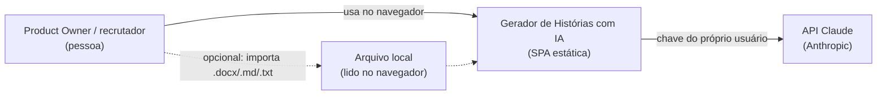
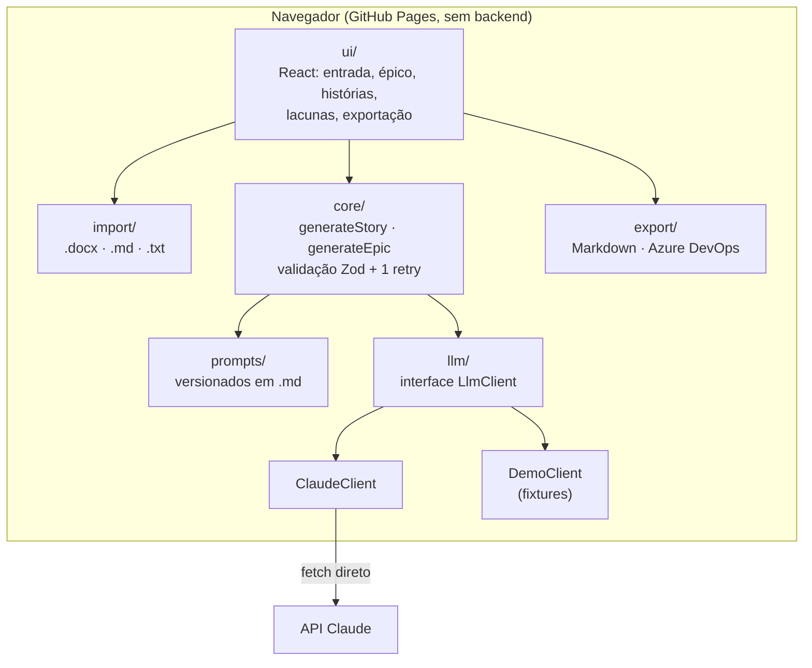

# Diagramas C4

## Nível 1 — Contexto

```mermaid
flowchart LR
  po["Product Owner / recrutador<br/>(pessoa)"] -->|usa no navegador| app["Gerador de Histórias com IA<br/>(SPA estática)"]
  app -->|chave do próprio usuário| api["API Claude<br/>(Anthropic)"]
  po -.->|opcional: importa .docx/.md/.txt| arq["Arquivo local<br/>(lido no navegador)"]
  arq -.-> app
```

## Nível 2 — Contêineres e componentes

```mermaid
flowchart TB
  subgraph navegador["Navegador (GitHub Pages, sem backend)"]
    ui["ui/<br/>React: entrada, épico, histórias,<br/>lacunas, exportação"]
    imp["import/<br/>.docx · .md · .txt"]
    core["core/<br/>generateStory · generateEpic<br/>validação Zod + 1 retry"]
    exp["export/<br/>Markdown · Azure DevOps"]
    prompts["prompts/<br/>versionados em .md"]
    llm["llm/<br/>interface LlmClient"]
    claude["ClaudeClient"]
    demo["DemoClient<br/>(fixtures)"]
  end
  api["API Claude"]

  ui --> imp
  ui --> core
  ui --> exp
  core --> prompts
  core --> llm
  llm --> claude
  llm --> demo
  claude -->|fetch direto| api
```

O `core` conhece apenas a interface `LlmClient`; `ClaudeClient` e `DemoClient` são intercambiáveis.
